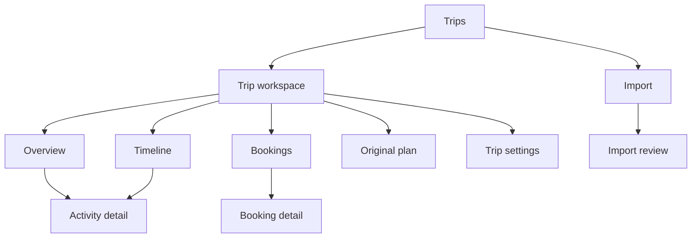
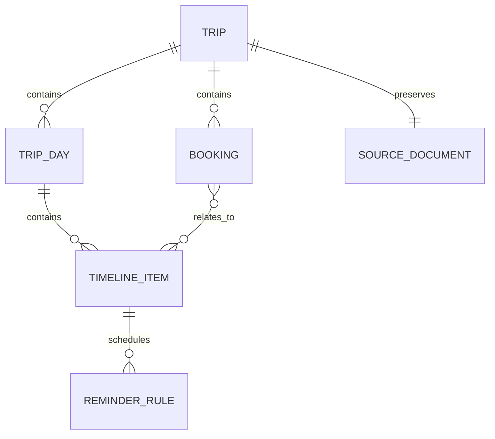
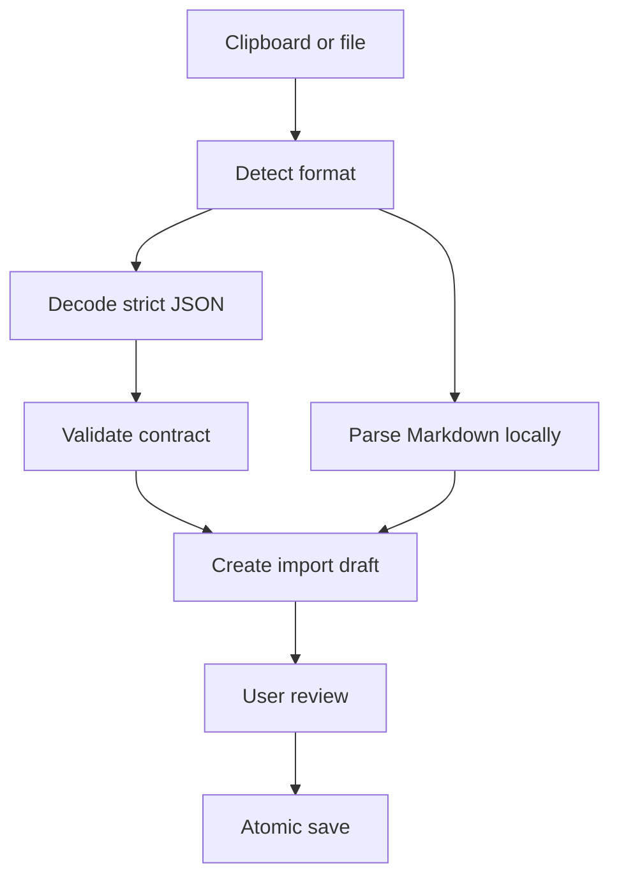
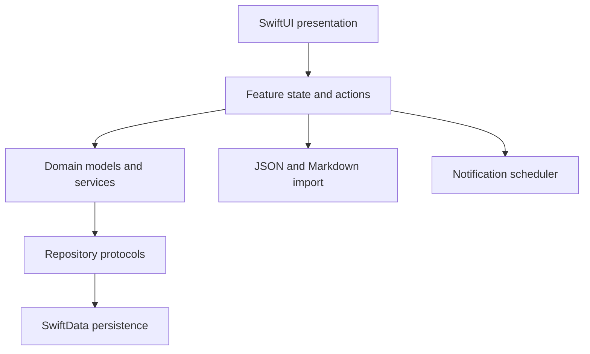

# Light Trip — Product and Technical Design

## 1. Document status

- Status: Proposed MVP design
- Platforms: iOS and iPadOS
- Minimum deployment target: iOS/iPadOS 17
- UI framework: SwiftUI
- Persistence: SwiftData
- Strict import contract: versioned Light Trip JSON from the clipboard, a `.json` file, or an embedded `light-trip` block
- Convenience import format: Markdown from the clipboard or a `.md` file

This document defines the initial product scope, information architecture, page-level design, data model, JSON contract, Markdown import behavior, and implementation boundaries for Light Trip.

## 2. Product vision

Light Trip is a lightweight, offline-first trip companion. It imports a strict JSON trip contract or converts a human-readable Markdown itinerary into a structured mobile experience that answers four questions quickly:

1. What is happening next?
2. What is the complete plan for today?
3. Where are my flight, train, hotel, attraction, and ground-transport details?
4. What must I confirm or remember before the next step?

The application is not an expense tracker. Cost, currency, budget, and expense-management functionality are intentionally excluded from the MVP.

## 3. Product principles

### 3.1 Trip-first

Every primary screen exists to support the trip itself: schedule, movement, reservations, instructions, and important timing constraints.

### 3.2 Glanceable during travel

The current or next activity must be visible within one interaction. Important times, locations, routes, and warnings should not be buried in prose.

### 3.3 Offline-first

An imported trip remains fully usable without a network connection. External links are enhancements, not dependencies for reading the plan.

### 3.4 Strict contract and lossless source import

Versioned JSON is the canonical interchange contract. Markdown is a best-effort convenience format. Light Trip preserves the original source content even when some Markdown cannot be parsed into structured records.

### 3.5 Explicit clipboard access

The application reads the clipboard only after the user taps a Paste control. It must not inspect clipboard contents automatically on launch or foreground activation.

### 3.6 Native and lightweight

The MVP uses Apple frameworks and avoids third-party dependencies. JSON uses `Codable`; Markdown uses a deterministic local parser. The architecture should remain easy to understand, test, and evolve.

## 4. MVP scope

### 4.1 Included

- Multiple trips
- Trip overview and countdown
- Day-by-day timeline
- Flight, train, hotel, attraction, and ground-transport bookings
- Important notes, buffers, and latest-safe-departure times
- Strict Light Trip JSON import from the clipboard or a file
- Deterministic Markdown import from the clipboard or a file
- Import preview, validation, and conflict handling
- Original source reader for JSON and Markdown
- Manual editing of trips, activities, and bookings
- Local notifications
- Local persistence with SwiftData
- Adaptive iPhone and iPad layouts
- Dark Mode, Dynamic Type, VoiceOver labels, and system localization infrastructure

### 4.2 Explicitly excluded from the MVP

- Costs, budgets, currencies, and expense tracking
- Purchasing or modifying reservations
- Live flight status or train inventory
- Airline, railway, hotel, or attraction account login
- Automatic extraction from email
- Shared multi-user trip editing
- Map-based route planning
- Ticket image and PDF attachment storage
- LLM-assisted Markdown parsing
- YAML import

The data model should not contain placeholder cost properties. If cost data exists in an imported source, it remains available only in the preserved source document.

## 5. Navigation architecture



### 5.1 iPhone navigation

- The Trips page is the application root.
- Opening a trip presents a four-tab workspace: Overview, Timeline, Bookings, and Plan.
- Detail pages use `NavigationStack` push navigation.
- Creation and editing flows use sheets.
- Import review uses a full-screen cover to provide enough space for validation.

### 5.2 iPad navigation

- A `NavigationSplitView` keeps trips and workspace destinations available in a sidebar.
- Timeline days or booking categories may occupy the content column.
- Selected activity or booking details appear in the detail column.
- Import and editing use resizable sheets where appropriate.

### 5.3 Shared navigation state

The iPhone and iPad containers share a typed navigation model:

```swift
enum AppDestination: Hashable {
    case trip(UUID)
    case overview(UUID)
    case timeline(UUID, dayID: UUID?)
    case bookings(UUID, category: BookingCategory?)
    case originalPlan(UUID)
    case activity(UUID)
    case booking(UUID)
    case tripSettings(UUID)
}
```

## 6. Page inventory

The MVP has ten primary pages and two reusable editor sheets.

| # | Page | Primary purpose |
|---|---|---|
| 1 | Trips | Find, create, import, archive, or open a trip |
| 2 | Trip Overview | Show the most relevant current and next information |
| 3 | Timeline | Present the complete day-by-day itinerary |
| 4 | Activity Detail | Show one itinerary item's complete operational detail |
| 5 | Bookings | Organize all reservations by date and category |
| 6 | Booking Detail | Show complete information for one reservation |
| 7 | Original Plan | Preserve and display the imported JSON or Markdown source |
| 8 | Import | Accept and validate clipboard or file input |
| 9 | Import Review | Preview parsed changes before committing them |
| 10 | Trip Settings | Configure metadata, reminders, export, archive, or deletion |

## 7. Detailed page design

### 7.1 Trips

#### Purpose

The Trips page is the app's root and the user's trip library.

#### Content

- Upcoming trips
- Active trip
- Past or archived trips
- Destination and title
- Date range and number of days
- Countdown or progress state
- Next important activity
- Synchronization state when iCloud support is enabled

#### Actions

- Open a trip
- Create a trip manually
- Import a trip
- Archive a completed trip
- Delete a trip after confirmation

#### iPhone design

Trips appear as vertically stacked cards. The primary toolbar action opens the Import page. A secondary menu provides manual creation and archived trips.

#### iPad design

Trips appear in the sidebar. Selecting a trip opens its Overview in the detail area. The sidebar remains available while navigating within the selected trip.

#### Empty state

The empty state explains the main value proposition and offers two actions: Import Trip and Create Trip.

#### Accessibility

The trip card accessibility label combines title, dates, trip state, and next activity. Color is never the only representation of state.

### 7.2 Trip Overview

#### Purpose

The Overview is the default destination after opening a trip. It prioritizes information based on the current date and time.

#### Content hierarchy

1. Trip header: destination, date range, traveler count, and status
2. Countdown before departure, or day progress during the trip
3. Next Up card
4. Remaining activities for today
5. Important information and unresolved confirmations
6. Compact booking summary

#### Next Up behavior

- Before the trip: show the earliest upcoming booking or timed activity.
- During the trip: show the next uncompleted timeline item.
- After the final activity: show the trip-complete state.
- If an item has a latest-safe-departure time, show it beside the planned time.

#### Actions

- Open the next activity
- Open the full timeline
- Open the related booking
- Mark a confirmation item as resolved
- Open Trip Settings

#### Visual design

The page uses a large Next Up card followed by smaller supporting cards. Categories use consistent symbols and accessible labels:

- Transport: blue
- Accommodation: indigo
- Attraction or activity: green
- Meal or break: neutral
- Important warning: orange

### 7.3 Timeline

#### Purpose

The Timeline is the complete chronological itinerary and the main operational view while traveling.

#### Content

- Horizontal day selector
- Day title and summary
- Vertical time rail
- Chronologically ordered timeline items
- Current-time marker while the trip is active
- Day-level important notes

#### Timeline card content

- Start and end time
- Activity title
- Origin and destination, when applicable
- Category icon and label
- Short operational note
- Confirmation state
- Buffer or latest-safe-departure indicator
- Related booking indicator

#### Filters

- All
- Transport
- Activities
- Hotels
- Meals and breaks
- Important

Filters affect only presentation and do not mutate the itinerary.

#### Actions

- Select another day
- Open an activity
- Add an activity
- Edit or delete an activity
- Jump to the current or next item

#### iPad design

The day list occupies the content column and the selected day's timeline occupies the detail column. Opening an item can present an inspector-style detail panel.

#### Timing behavior

Activity state is computed from trip timezone and the current time:

- Upcoming
- Current
- Completed

Manual completion is not required for ordinary timed activities. Untimed checklist-like items may be marked complete explicitly.

### 7.4 Activity Detail

#### Purpose

The Activity Detail page contains everything needed to complete one itinerary step without returning to the original Markdown.

#### Content

- Title and category
- Date, start time, and end time
- Origin, destination, or location
- Meeting point
- Full notes
- Preparation instructions
- Planned departure time
- Buffer duration
- Latest safe departure
- Related booking
- Official URL
- Contact phone number

#### Actions

- Open the location in Apple Maps
- Open the official link
- Call a stored contact number after user confirmation
- Copy selected information
- Open the related booking
- Edit or delete the activity
- Configure a reminder

#### Visual design

Planned time and hard timing constraints use separate rows. The latest safe departure receives additional emphasis without relying only on color.

### 7.5 Bookings

#### Purpose

The Bookings page provides a structured view of all reservations without requiring the user to search the Markdown.

#### Categories

- Flights
- Trains
- Hotels
- Attraction tickets
- Ground transport
- Other

#### Content

- Category filter
- Chronologically grouped bookings
- Provider and service number
- Route or property name
- Date and time
- Confirmation status
- Short unresolved-information message

#### Booking status

```swift
enum BookingStatus: String, Codable, CaseIterable {
    case planned
    case needsConfirmation
    case confirmed
    case completed
    case cancelled
}
```

#### Actions

- Filter by booking category
- Open booking details
- Add a booking manually
- Edit or delete a booking
- Open the provider's official URL

#### Visual design

Bookings are grouped by date rather than provider. Each card has a stable type-specific layout so flight, train, hotel, attraction, and charter information can be recognized quickly.

### 7.6 Booking Detail

#### Purpose

The Booking Detail page displays the complete structured information for one reservation.

#### Common fields

- Booking category
- Provider
- Status
- Reservation reference
- Start and end dates or times
- Notes
- Official URL
- Contact phone number
- Related timeline items

#### Type-specific fields

| Booking type | Additional fields |
|---|---|
| Flight | Flight number, origin/destination airports, terminals, baggage note |
| Train | Train number, stations, seat class, carriage, seat |
| Hotel | Address, check-in/out, room information |
| Attraction | Ticket type, entrance, meeting point, opening window |
| Ground transport | Pickup/drop-off, driver, vehicle number, meeting point |

#### Privacy behavior

Reservation references are masked by default. Revealing or copying a reference requires a deliberate user action.

#### Actions

- Reveal or copy the reservation reference
- Open the provider link
- Open a location in Maps
- Call the provider or driver
- Open related activities
- Edit or delete the booking

Ticket image and PDF attachments are deferred until after the MVP.

### 7.7 Original Plan

#### Purpose

The Original Plan page guarantees that imported information remains accessible even when it cannot be represented by the structured model.

#### Modes

- Reader: mobile-friendly Markdown rendering or a formatted JSON tree
- Source: unmodified source text with JSON syntax highlighting when applicable

#### Functions

- Search within the document
- Collapse and expand sections
- Copy the complete source
- Export the original `.json`, `.md`, `.markdown`, or plain-text format
- Start an update import
- Show the source format, schema or parser version, and last import date

#### Responsive behavior

Markdown tables transform into stacked cards on compact-width devices. JSON uses collapsible objects and arrays. On iPad, an optional section outline or JSON tree appears beside the document.

### 7.8 Import

#### Purpose

The Import page captures Light Trip JSON or Markdown and starts the appropriate validation or parsing workflow.

#### Import sources

- Paste from clipboard
- Select a `.lighttrip.json`, `.json`, `.md`, `.markdown`, or plain-text file
- Paste or edit text manually
- Load a bundled sample trip

#### Functions

- Explicit user-initiated clipboard access
- Text editing before parsing
- Automatic format detection with a visible override
- Strict JSON contract validation
- Deterministic Markdown itinerary detection and parsing
- Selection of Create New Trip or Update Existing Trip

#### Validation before review

- Input is not empty
- Input is valid text
- JSON input is syntactically valid and matches a supported `schemaVersion`
- Markdown contains at least a title, date, day heading, timeline table, or booking table
- Unsupported Markdown is allowed and preserved

#### Error design

JSON validation errors identify the failing field and contract rule. Markdown diagnostics explain ambiguity without discarding source content. The pasted text remains in the editor after an error.

### 7.9 Import Review

#### Purpose

The Import Review page prevents silent or incorrect data changes.

#### Summary

- Detected trip title and date range
- Detected source format and schema or parser version
- Number of trip days
- Number of timeline items
- Booking counts by category
- Warning and ambiguity count
- Unrecognized-section count

#### Review sections

- Trip metadata
- Days and timeline items
- Bookings
- Important notes
- Unrecognized Markdown, when applicable

#### Actions

- Expand a section
- Include or exclude a parsed record
- Correct an ambiguous date or type
- Create a new trip
- Update an existing trip
- Cancel without saving

#### Update behavior

Before updating an existing trip, show the number of items to add, modify, preserve, and remove. No stored trip is replaced without explicit confirmation.

#### Duplicate matching

Timeline candidates use normalized date, time, title, category, and route. Booking candidates use category, provider, service number, and start date. Ambiguous matches are shown for review rather than merged automatically.

### 7.10 Trip Settings

#### Purpose

Trip Settings controls metadata, reminders, document lifecycle, and destructive operations for one trip.

#### Metadata

- Trip title
- Destination
- Start and end dates
- Trip timezone
- Traveler count

#### Reminder settings

- Daily morning summary
- Reminder before transport
- Reminder before a latest-safe-departure time
- Booking confirmation reminders
- Per-activity custom reminder

#### Document actions

- Export canonical Light Trip JSON
- Export or copy the preserved original source
- Reimport or replace the trip
- View import metadata
- Archive the trip
- Delete the trip

#### Destructive operations

Archive, replace, and delete actions are placed in a visually separate section and require confirmation. Deleting a trip removes its days, activities, bookings, reminders, and source document.

## 8. Reusable editor sheets

### 8.1 Activity Editor

Fields:

- Title
- Category
- Date
- Start and end time
- All-day or untimed flag
- Location, origin, and destination
- Meeting point
- Notes
- Buffer duration
- Latest safe departure
- Related booking
- Reminder configuration

Validation prevents an end time earlier than the start time and warns when an item falls outside the trip dates.

### 8.2 Booking Editor

Common fields appear first. Type-specific fields appear after selecting Flight, Train, Hotel, Attraction, Ground Transport, or Other.

The editor supports linking one booking to multiple timeline items. For example, one hotel booking can relate to check-in, stay, breakfast, luggage storage, and check-out activities.

## 9. Data model

### 9.1 Relationship model



### 9.2 Trip

```swift
@Model
final class Trip {
    @Attribute(.unique) var id: UUID
    var title: String
    var destination: String
    var startDate: Date
    var endDate: Date
    var timeZoneIdentifier: String
    var travelerCount: Int
    var createdAt: Date
    var updatedAt: Date
    var archivedAt: Date?

    @Relationship(deleteRule: .cascade, inverse: \TripDay.trip)
    var days: [TripDay]

    @Relationship(deleteRule: .cascade, inverse: \Booking.trip)
    var bookings: [Booking]

    @Relationship(deleteRule: .cascade, inverse: \SourceDocument.trip)
    var sourceDocument: SourceDocument?
}
```

### 9.3 TripDay

```swift
@Model
final class TripDay {
    @Attribute(.unique) var id: UUID
    var date: Date
    var sequence: Int
    var title: String
    var summary: String?
    var importantNotes: [String]
    var trip: Trip?

    @Relationship(deleteRule: .cascade, inverse: \TimelineItem.day)
    var items: [TimelineItem]
}
```

### 9.4 TimelineItem

```swift
@Model
final class TimelineItem {
    @Attribute(.unique) var id: UUID
    var title: String
    var categoryRawValue: String
    var startDate: Date?
    var endDate: Date?
    var isUntimed: Bool
    var origin: String?
    var destination: String?
    var locationName: String?
    var meetingPoint: String?
    var notes: String?
    var bufferMinutes: Int?
    var latestSafeDeparture: Date?
    var officialURL: URL?
    var contactPhone: String?
    var requiresConfirmation: Bool
    var isManuallyCompleted: Bool
    var sourceFingerprint: String?
    var sequence: Int
    var day: TripDay?
    var bookings: [Booking]
    var reminders: [ReminderRule]
}
```

### 9.5 Booking

To keep the model queryable while supporting different booking types, common fields remain on `Booking` and type-specific values are stored in a Codable detail payload.

```swift
@Model
final class Booking {
    @Attribute(.unique) var id: UUID
    var categoryRawValue: String
    var provider: String
    var statusRawValue: String
    var reference: String?
    var startDate: Date?
    var endDate: Date?
    var officialURL: URL?
    var contactPhone: String?
    var notes: String?
    var detailsData: Data
    var sourceFingerprint: String?
    var trip: Trip?
    var timelineItems: [TimelineItem]
}
```

The detail payload is versioned and represented by a Codable enum in the domain layer:

```swift
enum BookingDetails: Codable, Hashable {
    case flight(FlightDetails)
    case train(TrainDetails)
    case hotel(HotelDetails)
    case attraction(AttractionDetails)
    case groundTransport(GroundTransportDetails)
    case other(OtherBookingDetails)
}
```

### 9.6 SourceDocument

```swift
@Model
final class SourceDocument {
    @Attribute(.unique) var id: UUID
    var rawContent: String
    var sourceFormatRawValue: String
    var importedAt: Date
    var contractVersion: Int?
    var parserVersion: Int?
    var sourceName: String?
    var contentHash: String
    var trip: Trip?
}
```

### 9.7 ReminderRule

```swift
@Model
final class ReminderRule {
    @Attribute(.unique) var id: UUID
    var offsetMinutes: Int
    var title: String
    var isEnabled: Bool
    var notificationIdentifier: String?
    var timelineItem: TimelineItem?
}
```

### 9.8 Enumerations

Persisted enums use stable raw string values so future cases can be added without changing the storage schema.

```swift
enum TimelineCategory: String, Codable, CaseIterable {
    case transport
    case activity
    case accommodation
    case meal
    case breakTime
    case reminder
    case other
}

enum BookingCategory: String, Codable, CaseIterable {
    case flight
    case train
    case hotel
    case attraction
    case groundTransport
    case other
}

enum SourceFormat: String, Codable, CaseIterable {
    case lightTripJSON
    case markdown
    case plainText
}
```

## 10. Core functionality

### 10.1 Import pipeline



#### Stage 1: Preserve and detect

- Preserve the complete original input before normalization.
- Detect standalone JSON, a Markdown `light-trip` block, Markdown, or plain text.
- Normalize line endings
- Remove UTF-8 byte-order marks
- Normalize full-width punctuation only for matching, not for display

#### Stage 2A: Decode strict JSON

- Decode with `JSONDecoder` into versioned Codable contract types.
- Require a supported integer `schemaVersion`.
- Validate required fields, enum values, identifiers, relationships, dates, times, and the IANA timezone.
- Do not coerce malformed values or silently repair invalid JSON.
- Ignore unknown additive fields for forward compatibility while preserving the original JSON.
- Return field-addressable diagnostics such as `days[1].items[3].startTime`.

#### Stage 2B: Parse Markdown deterministically

The parser recognizes:

- H1 trip title
- Blockquote metadata
- Date ranges
- `Day N` headings and localized equivalents
- Timeline tables
- Flight and hotel tables
- Core-transport tables
- Lists of warnings, confirmations, and checklists
- Links and contact numbers

The MVP parser is a deterministic local utility with no network dependency. Cost-like columns are skipped by structured parsing and remain only in `SourceDocument.rawContent`.

#### Stage 3: Build an import draft

Parsing never writes directly to SwiftData. It produces immutable draft values and diagnostics:

```swift
struct TripImportDraft: Sendable {
    var trip: TripDraft
    var days: [TripDayDraft]
    var bookings: [BookingDraft]
    var unrecognizedContent: [SourceFragment]
    var diagnostics: [ImportDiagnostic]
}
```

#### Stage 4: Review

The user can correct ambiguity, exclude records, or cancel. Warnings do not discard source content.

#### Stage 5: Commit

The repository layer performs one transaction. If any required model fails validation, no partial trip is stored.

### 10.2 Strict Light Trip JSON contract

JSON is the canonical interchange, backup, and round-trip format. The contract is independent of SwiftData persistence models so storage migrations do not automatically break imported files.

YAML is intentionally not a contract format in the MVP. Its indentation and implicit scalar typing introduce avoidable ambiguity, and Swift does not provide a first-party YAML decoder comparable to `Codable` JSON support.

Required contract rules:

- `schemaVersion` is a required positive integer.
- Stable entity identifiers are UUID strings.
- Calendar dates use ISO `YYYY-MM-DD`.
- Local times use 24-hour `HH:mm`; cross-timezone timestamps use RFC 3339.
- The trip uses an IANA timezone such as `Asia/Shanghai`.
- Persisted categories and statuses use documented string enums.
- A missing optional field and an explicit `null` have the same meaning unless the schema states otherwise.
- Derived UI values such as countdowns and next-item state are never serialized.
- Costs and expense fields are not part of schema version 1.

The repository should contain these contract artifacts:

```text
docs/
├── schema/light-trip.schema.json
└── examples/
    ├── sample-trip.lighttrip.json
    └── sample-trip.md
```

Minimal contract shape:

```json
{
  "schemaVersion": 1,
  "trip": {
    "id": "7c7d5c44-67c1-4f18-913b-c7bf21cb403a",
    "title": "Western Sichuan Autumn Trip",
    "destination": "Chengdu, Huanglong, and Jiuzhaigou",
    "startDate": "2026-10-04",
    "endDate": "2026-10-08",
    "timeZone": "Asia/Shanghai"
  },
  "days": [],
  "bookings": [],
  "reminders": []
}
```

The JSON Schema is the normative contract for files. Codable types implement that contract in the app, and contract fixtures verify both decoding and schema-version migration.

### 10.3 Canonical Markdown convenience example

The following document is the reference fixture for the first importer implementation. It is intentionally fictional, contains no cost fields, and exercises every MVP booking category. Users may omit optional columns or sections; the Import Review page must surface missing or ambiguous values instead of rejecting the whole document.

Canonical conventions demonstrated by the fixture:

- Use one H1 heading for the trip title.
- Put trip metadata in blockquotes using `Key: Value` pairs.
- Use ISO `YYYY-MM-DD` dates and 24-hour local times when possible.
- Start each itinerary section with `## Day N — YYYY-MM-DD — Title`.
- Use an em dash (`—`) for an intentionally empty table cell.
- Keep booking references fictional in examples and mask real references in the UI.
- Treat checklist items under `## Reminders` as confirmation tasks, not timeline activities.

````markdown
# Western Sichuan Autumn Trip

> Dates: 2026-10-04 to 2026-10-08
> Destination: Chengdu, Huanglong, and Jiuzhaigou
> Time zone: Asia/Shanghai
> Travelers: 2

## Day 1 — 2026-10-04 — Arrive in Chengdu

| Time | Type | Plan | From | To / Location | Booking | Buffer | Confirmation | Notes |
|---|---|---|---|---|---|---|---|---|
| 12:30–15:30 | Flight | Fly to Chengdu | Shanghai Hongqiao Airport | Chengdu Shuangliu Airport | MU0001 | 90 min | Confirmed | Example flight number |
| 15:30–17:15 | Ground transport | Collect baggage and transfer to hotel | Chengdu Shuangliu Airport | East Railway Station Hotel | — | 30 min | Required | Allow extra holiday traffic time |
| 18:00–19:00 | Meal | Dinner near the hotel | — | Chengdu East Railway Station | — | — | — | Keep the evening flexible |

## Day 2 — 2026-10-05 — Huanglong and Jiuzhaigou

| Time | Type | Plan | From | To / Location | Booking | Buffer | Confirmation | Notes |
|---|---|---|---|---|---|---|---|---|
| 07:40–08:12 | Reminder | Arrive and board | Chengdu East Railway Station | Platform shown in railway app | C0001 | 30 min | Required | Identity document required |
| 08:12–10:01 | Train | Travel to Huanglongjiuzhai | Chengdu East Railway Station | Huanglongjiuzhai Station | C0001 | — | Confirmed | First class |
| 10:10–11:20 | Ground transport | Reserved car to Huanglong | Huanglongjiuzhai Station | Huanglong Scenic Area | CAR-01 | 20 min | Confirmed | Meet at station exit |
| 11:20–15:30 | Attraction | Visit Huanglong | Visitor Center | Five-Color Pond route | HL-01 | 30 min | Required | Use the uphill cableway booking |
| 15:30–18:30 | Ground transport | Reserved car to Jiuzhaigou | Huanglong Scenic Area | Jiuzhaigou Hotel | CAR-01 | 60 min | Confirmed | Holiday road buffer included |
| 18:30–19:00 | Accommodation | Check in | — | Jiuzhaigou Hotel | HOTEL-02 | — | Confirmed | Two-night stay |

## Day 3 — 2026-10-06 — Jiuzhaigou Full Day

| Time | Type | Plan | From | To / Location | Booking | Buffer | Confirmation | Notes |
|---|---|---|---|---|---|---|---|---|
| 07:50–08:20 | Ground transport | Walk to the entrance and complete checks | Jiuzhaigou Hotel | Scenic Area Entrance | JZG-VIP-01 | 30 min | Required | Bring identity document |
| 08:20–12:00 | Attraction | Rize Valley highlights | Scenic Area Entrance | Five-Flower Lake and Pearl Shoal | JZG-VIP-01 | — | Confirmed | Follow the official VIP bus route |
| 12:00–12:45 | Meal | Lunch | — | Nuorilang Service Center | — | — | — | Avoid the peak queue if possible |
| 12:45–17:00 | Attraction | Zechawa and Shuzheng Valley highlights | Nuorilang Service Center | Long Lake, Five-Color Pond, and Shuzheng Lakes | JZG-VIP-01 | 30 min | Confirmed | Exit before the final bus rush |

## Day 4 — 2026-10-07 — Jiuzhaigou Half Day and Chengdu

| Time | Type | Plan | From | To / Location | Booking | Buffer | Confirmation | Notes |
|---|---|---|---|---|---|---|---|---|
| 08:15–11:40 | Attraction | Shuzheng Valley revisit | Scenic Area Entrance | Rhinoceros Lake and Shuzheng Lakes | JZG-STD-02 | 30 min | Required | Leave the scenic area on time |
| 12:50–15:50 | Ground transport | Reserved car to station | Jiuzhaigou Hotel | Huanglongjiuzhai Station | CAR-01 | 60 min | Confirmed | Latest safe departure is 12:50 |
| 16:25–18:07 | Train | Return to Chengdu | Huanglongjiuzhai Station | Chengdu East Railway Station | C0002 | 30 min | Confirmed | First class |
| 18:20–19:00 | Ground transport | Transfer to hotel | Chengdu East Railway Station | Central Chengdu Hotel | — | 20 min | Required | Use the official taxi queue |

## Day 5 — 2026-10-08 — Depart Chengdu

| Time | Type | Plan | From | To / Location | Booking | Buffer | Confirmation | Notes |
|---|---|---|---|---|---|---|---|---|
| 12:30–13:30 | Accommodation | Check out and depart | Central Chengdu Hotel | Chengdu Tianfu Airport | HOTEL-03 | 60 min | Required | Confirm traffic before leaving |
| 16:00–18:35 | Flight | Fly to Shanghai | Chengdu Tianfu Airport | Shanghai Pudong Airport | MU0002 | 120 min | Confirmed | Example flight number |

## Bookings

### Flights

| Service | Date | Route | Departure | Arrival | Provider | Status | Reference | Official link | Notes |
|---|---|---|---|---|---|---|---|---|---|
| MU0001 | 2026-10-04 | Shanghai Hongqiao → Chengdu Shuangliu | 12:30 | 15:30 | Example Airline | Confirmed | FLIGHT-OUT-EXAMPLE | https://example.com/flight | Example only |
| MU0002 | 2026-10-08 | Chengdu Tianfu → Shanghai Pudong | 16:00 | 18:35 | Example Airline | Confirmed | FLIGHT-IN-EXAMPLE | https://example.com/flight | Example only |

### Trains

| Service | Date | Route | Departure | Arrival | Seat | Status | Reference | Notes |
|---|---|---|---|---|---|---|---|---|
| C0001 | 2026-10-05 | Chengdu East → Huanglongjiuzhai | 08:12 | 10:01 | First class | Confirmed | TRAIN-OUT-EXAMPLE | Arrive 30 minutes early |
| C0002 | 2026-10-07 | Huanglongjiuzhai → Chengdu East | 16:25 | 18:07 | First class | Confirmed | TRAIN-IN-EXAMPLE | Arrive 30 minutes early |

### Hotels

| Hotel | Check-in | Check-out | Location | Status | Reference | Contact | Notes |
|---|---|---|---|---|---|---|---|
| East Railway Station Hotel | 2026-10-04 | 2026-10-05 | Chengdu East Railway Station | Confirmed | HOTEL-01 | — | One night |
| Jiuzhaigou Hotel | 2026-10-05 | 2026-10-07 | Jiuzhaigou Scenic Area Entrance | Confirmed | HOTEL-02 | — | Two nights |
| Central Chengdu Hotel | 2026-10-07 | 2026-10-08 | Central Chengdu | Confirmed | HOTEL-03 | — | One night |

### Attractions

| Attraction | Visit date | Entry window | Product | Status | Reference | Official link | Notes |
|---|---|---|---|---|---|---|---|
| Huanglong Scenic Area | 2026-10-05 | 11:20–12:00 | Admission + uphill cableway + sightseeing bus | Confirmed | HL-01 | https://example.com/huanglong | Example only |
| Jiuzhaigou National Park | 2026-10-06 | 08:00–09:00 | Admission + official VIP sightseeing bus | Confirmed | JZG-VIP-01 | https://example.com/jiuzhaigou | Example only |
| Jiuzhaigou National Park | 2026-10-07 | 08:00–09:00 | Admission + standard sightseeing bus | Confirmed | JZG-STD-02 | https://example.com/jiuzhaigou | Example only |

### Ground Transport

| Reference | Date | Route | Pickup | Provider | Status | Contact | Notes |
|---|---|---|---|---|---|---|---|
| CAR-01 | 2026-10-05 to 2026-10-07 | Station → Huanglong → Jiuzhaigou → Station | Huanglongjiuzhai Station exit | Example Car Service | Confirmed | — | One reservation covers the complete route |

## Reminders

- [ ] Recheck the Huanglong admission, uphill cableway, and sightseeing-bus booking.
- [ ] Recheck the Jiuzhaigou VIP admission and bus booking.
- [ ] Recheck the second-day Jiuzhaigou admission and standard bus booking.
- [ ] Confirm the reserved-car driver's meeting point one day before pickup.
- [ ] Download offline copies of all booking details before departure.

## Important Notes

- All times use `Asia/Shanghai`.
- Holiday traffic buffers are already included in the timeline.
- A booking marked `Required` needs confirmation during Import Review.
- Links and identifiers in this sample are fictional and must not be used for real travel.
````

Expected import result:

- 1 trip containing 5 days and 19 timeline items
- 2 flight, 2 train, 3 hotel, 3 attraction, and 1 ground-transport booking
- Booking references linked to timeline items with the same `Booking` value
- 5 confirmation tasks derived from the Reminders checklist
- Original Markdown preserved unchanged in `SourceDocument.rawContent`

This fixture should be copied into the test target as `canonical-trip.md`. Parser changes that alter its expected result require an intentional fixture update and test review.

### 10.4 Structured Markdown carrier

Markdown may carry the strict contract in a fenced `light-trip` JSON block:

````markdown
```light-trip
{
  "schemaVersion": 1,
  "trip": {},
  "days": [],
  "bookings": []
}
```
````

When present, the importer treats this block as authoritative, validates it exactly like a standalone JSON file, and does not derive competing structured values from the surrounding Markdown. The complete Markdown remains available as the preserved human-readable source.

### 10.5 Post-MVP TODO: LLM-assisted Markdown parsing

A future release may offer an LLM parser for prose-heavy or irregular Markdown that the deterministic parser cannot interpret reliably. This is an optional enhancement, not a replacement for the JSON contract or the local parser.

Implementation boundaries:

- Introduce a `TripImportParser` protocol so deterministic and LLM parsers produce the same `TripImportDraft` result.
- Keep deterministic parsing as the default and offline fallback.
- Invoke an LLM only after an explicit user action; never upload trip content automatically or in the background.
- Clearly disclose when source content will leave the device and minimize the submitted content where practical.
- Treat imported text as untrusted data, never as executable instructions for the model or app.
- Require the LLM to return only the versioned Light Trip JSON contract.
- Reject output that fails JSON decoding or contract validation; do not repair it silently.
- Preserve provenance, parser kind, model identifier, and per-record confidence or diagnostics.
- Always show Import Review before persistence and highlight low-confidence or newly inferred fields.
- Never allow an LLM result to remove or replace stored records without an explicit diff confirmation.
- Keep the original source so users can verify every extracted value.

Before release, evaluate the LLM parser against the same fixture suite as the deterministic parser. Track field accuracy, invented-value rate, missing-record rate, latency, and failure behavior. Network failure, model unavailability, or an unsupported response must return the user to deterministic parsing without losing input.

### 10.6 Next-item calculation

The Overview calculates the next item using the trip timezone rather than the device timezone. Untimed items do not replace the next timed item unless explicitly marked important.

### 10.7 Local notifications

- Notification permission is requested only when the user first enables a reminder.
- Notifications are scheduled from `ReminderRule` records.
- Import updates reconcile changed or deleted notifications.
- Timezone-aware calendar triggers are preferred over fixed UTC timestamps.
- The app displays all reminder rules even if system notification permission is denied.

### 10.8 Search

Search spans:

- Activity titles and notes
- Locations, origins, and destinations
- Booking providers and service numbers
- Original JSON or Markdown source

Search remains local to the device in the MVP.

### 10.9 Export

The user can export canonical Light Trip JSON generated from structured records and can separately export the preserved original source. Human-readable Markdown export is optional, but it must never overwrite the original source silently.

## 11. Application architecture



### 11.1 Layers

#### Presentation

- SwiftUI views
- Adaptive navigation containers
- Display formatters
- Accessibility semantics

#### Feature layer

- Observable feature models
- User actions and screen state
- Navigation intents
- Import workflow coordination

#### Domain

- Draft and display models
- Parser contracts
- Next-item calculation
- Duplicate matching
- Validation rules

#### Data

- SwiftData models
- Repository implementations
- Atomic import transaction
- Migration configuration

#### System services

- Clipboard import
- File import and export
- Local notifications
- Maps and URL opening
- Optional iCloud synchronization

### 11.2 Proposed source structure

```text
LightTrip/
├── App/
│   ├── LightTripApp.swift
│   ├── AppEnvironment.swift
│   └── AppNavigation.swift
├── Models/
│   ├── Persistence/
│   ├── Domain/
│   └── Drafts/
├── Features/
│   ├── Trips/
│   ├── Overview/
│   ├── Timeline/
│   ├── Bookings/
│   ├── OriginalPlan/
│   ├── Import/
│   └── TripSettings/
├── Services/
│   ├── TripImport/
│   │   ├── JSONContract/
│   │   └── Markdown/
│   ├── Notifications/
│   ├── Search/
│   └── Export/
├── Shared/
│   ├── Components/
│   ├── Formatting/
│   └── Extensions/
└── Resources/
    ├── Localizable.xcstrings
    └── SampleTrips/

LightTripTests/
├── TripImport/
│   ├── JSONContract/
│   └── Markdown/
├── Domain/
├── Persistence/
└── Fixtures/

LightTripUITests/
```

### 11.3 Dependency policy

The MVP uses no third-party packages. Protocol boundaries allow an LLM-backed Markdown parser, synchronization service, or attachment store to be introduced later without rewriting page code.

## 12. Responsive and visual design

### 12.1 Design language

- Native typography and controls
- System materials rather than custom glass effects
- SF Symbols for category identification
- Rounded cards with restrained elevation
- Semantic colors that adapt automatically to appearance and accessibility settings

### 12.2 Compact width

- Bottom tab navigation
- Single-column lists
- Full-width cards
- Stacked representations for imported tables
- Large tap targets suitable for use while moving

### 12.3 Regular width

- Sidebar and multi-column navigation
- Persistent selection
- Detail inspectors
- Wider timeline presentation
- Keyboard shortcuts for import, search, and new item

### 12.4 Accessibility

- Dynamic Type without clipped critical information
- VoiceOver labels that combine time, type, title, and status
- Minimum 44-point interactive targets
- State represented with labels and symbols in addition to color
- Reduce Motion support
- High-contrast and Dark Mode verification

## 13. Persistence and synchronization

### 13.1 Local storage

SwiftData is the authoritative MVP store. Autosave is acceptable for manual edits, while imports use an explicit transaction boundary.

### 13.2 iCloud strategy

The model is designed to remain compatible with SwiftData and CloudKit synchronization. Initial implementation should stabilize the local schema and import behavior before enabling iCloud entitlements.

When enabled, iCloud provides cross-device synchronization between the user's iPhone and iPad without introducing a custom account system or backend.

### 13.3 Migration

- Every Light Trip JSON payload has a schema version.
- Every source document stores its format and the applicable contract or parser version.
- Persisted enums use stable raw values.
- Model migrations must preserve the original source even if a structured migration fails.

## 14. Privacy and security

- All trip data is local by default.
- Clipboard reads require a user-initiated Paste action.
- Any future cloud LLM parsing requires a separate user-initiated action and clear disclosure that selected source content leaves the device.
- Reservation references are masked by default.
- No analytics SDK is required for the MVP.
- No booking credentials or payment information are stored.
- External URLs open only after a user action.
- Deletion requires confirmation and removes related notifications.

## 15. Testing strategy

### 15.1 Contract and parser tests

- Valid versioned Light Trip JSON
- JSON syntax, required-field, enum, relationship, date, and timezone failures
- Unsupported and future schema versions
- Unknown additive JSON fields
- JSON round-trip stability
- Current Jiuzhaigou Markdown plan
- Canonical Markdown convenience fixture
- Different heading languages and numbering formats
- Missing columns
- Reordered columns
- Multiline table cells
- Unrecognized sections
- Documents containing cost columns
- Invalid dates and time ranges
- Duplicate activities and bookings
- Reimport of an updated trip

### 15.2 Domain tests

- Next activity before, during, and after a trip
- Trip-timezone behavior
- Latest-safe-departure calculation
- Booking status presentation
- Duplicate matching

### 15.3 Persistence tests

- Cascade deletion
- Atomic import
- Import cancellation
- Update versus create behavior
- Source-document preservation

### 15.4 UI tests

- Empty-state import
- Clipboard import and review
- Timeline day switching
- Booking filtering
- Editing an activity and booking
- iPhone compact-width navigation
- iPad split-view navigation
- Dynamic Type and Dark Mode smoke tests

## 16. Implementation sequence

### Phase 1: Foundation

- Create the universal Xcode project
- Add SwiftData models and repositories
- Add typed navigation
- Add test targets, JSON contract fixtures, and the Jiuzhaigou Markdown fixture

### Phase 2: Import pipeline

- Define Codable contract types and `light-trip.schema.json`
- Implement strict JSON decoding, validation, and version handling
- Build deterministic Markdown normalization and section parsing
- Parse trip metadata, days, timeline items, and bookings
- Implement diagnostics and duplicate matching
- Implement atomic persistence

### Phase 3: Core UI

- Trips
- Overview
- Timeline and Activity Detail
- Bookings and Booking Detail
- Original Plan

### Phase 4: Editing and reminders

- Activity and Booking editors
- Trip Settings
- Local notification scheduling and reconciliation

### Phase 5: Hardening

- iPad optimization
- Accessibility
- Search and export
- Parser fixtures and UI automation
- Performance and offline verification

### Phase 6: Post-MVP

- Enable iCloud synchronization
- Ticket image and PDF attachments
- Share extension for Markdown import
- Optional LLM-assisted Markdown parser behind `TripImportParser`
- Widgets and Live Activities
- Optional live transport-status integrations using supported official APIs

## 17. MVP acceptance criteria

The MVP is complete when:

1. A user can import valid versioned Light Trip JSON with deterministic results.
2. Invalid JSON produces field-addressable errors and never creates partial data.
3. A user can paste the current Jiuzhaigou Markdown itinerary and review the parsed result.
4. Import creates a trip with correct dates, days, timeline items, flights, trains, hotels, attractions, and ground transport.
5. Cost columns are excluded from structured data without losing the original source.
6. The Overview shows the correct next item in the trip timezone.
7. The complete trip is usable offline after import.
8. Timeline and booking details work on both iPhone and iPad layouts.
9. Importing an updated plan shows a change preview before modifying stored data.
10. Local reminders remain consistent after activities are edited, reimported, or deleted.
11. The original JSON or Markdown source can be searched, copied, and exported.
12. Structured records can be exported as valid Light Trip JSON.
13. Unit and UI tests cover the critical import and navigation flows.

## 18. Open decisions

These decisions do not block the initial project scaffold, but they should be finalized before the associated phase:

1. Whether iCloud synchronization ships in the MVP or immediately after it.
2. Whether ticket image/PDF attachments move into the MVP.
3. Whether the first release is Simplified Chinese only or bilingual English and Simplified Chinese.
4. Whether a trip may have multiple editors in a future shared-trip feature.
5. Whether LLM-assisted parsing uses an on-device model, a cloud provider, or both.
